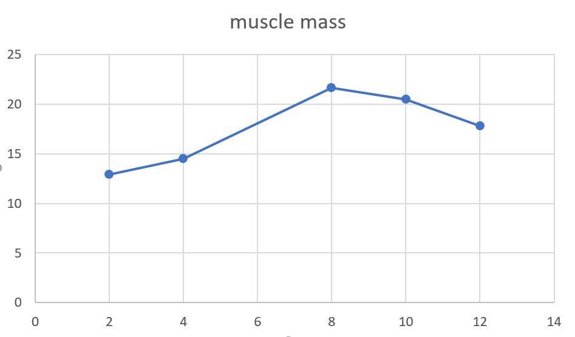
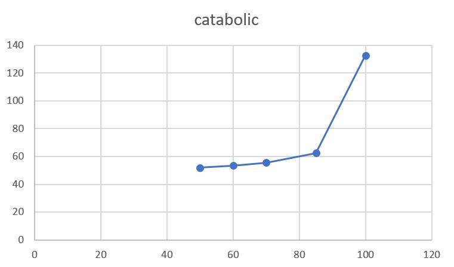
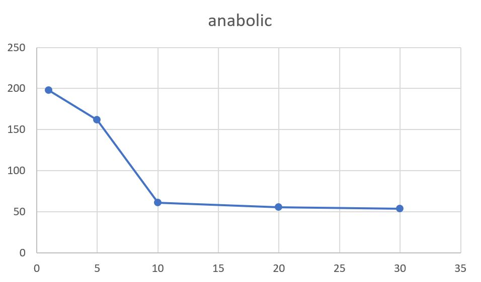

## Імітаційне моделювання комп'ютерних систем
## СПм-21-2, Могилевський Дмитро Ігорович
### Лабораторна робота №1. Опис імітаційних моделей
 

## Обрана модель в середовищі NetLogo:
[Muscle Development](http://www.netlogoweb.org/launch#http://www.netlogoweb.org/assets/modelslib/Sample%20Models/Biology/Muscle%20Development.nlogo)
 

### Вербальний опис моделі:
Muscle Development - це фізіологічна модель вправ. Модель призначена для того, щоб допомогти зрозуміти фактори, що беруть участь у створенні відповідного гормонального балансу для розвитку м’язів під час фізичних вправ (підняття ваги).

Нарощування м'язів після силового тренування виникає в результаті гормональних реакцій, які відбуваються в організмі. 
Гормони, необхідні для розвитку м'язів, можна розділити на два великі класи: катаболічні гормони та анаболічні гормони. 
Катаболічні гормони руйнують м’язове волокно, щоб підготувати його до побудови м'язів за допомогою анаболічних гормонів. 
Примітка: катаболічні гормони відіграють життєво важливу роль, оскільки м’язові волокна мають бути розщеплені, перш ніж їх можна буде наростити.

Ця модель моделює ці ефекти за допомогою зображення поперечного перерізу м’яза на рівні м’язових волокон. Коли спостерігач активує м’язове волокно за допомогою силового тренування, волокно вивільняє хімічний сигнал, який призводить до сплеску гормонів у місці розташування волокна. Ці гормони впливають на розвиток волокон, як згадувалося вище, і з часом розщіпляються.

Кола позначають м'язові волокна. Тло, на якому вони з’являються, можна розглядати як клітинну рідину, яка містить анаболічні та катаболічні гормони. Чим яскравіший зелений, тим сильніше анаболічне (нарощування м’язів) середовище. Чим яскравіший жовтий, тим сильніше катаболічне (руйнування м’язів) середовище.

### Керуючі параметри:
- **intensity** - інтенсивність фізичних навантажень. Чим більша інтенсивність, тим більша кількість м’язових волокон буде втомлюватися під час кожного тренування.
- **hours-of-sleep** - кількість годин сну (клькість сну людини впливає на те, наскільки швидко організм розщеплює гормони).
- **days-between-workouts** - кількість днів між тренуваннями (частота тренувань впливає на те, скільки часу має тіло на відновлення).
- **%-slow-twitch-fibers** - наскільки ймовірно, що кожне волокно має характеристики повільного скорочення.
- **lift?** - параметр визначає чи активно людина піднімає тяжкості.

### Внутрішні параметри:
- **anabolic-hormone**. Гормон нарощування м'язів
- **catabolic-hormone**. Гормон розпаду м'язів
- **fiber-size**. Розмір волокон
- **max-size**. Максимальний розмір волокон
- **muscle-mass**. Розмір м'язових волокон
- **anabolic-hormone-max**
- **anabolic-hormone-min**
- **catabolic-hormone-max**
- **catabolic-hormone-min**
- **hormone-diffuse-rate**. Швидкість, з якою гормони дифундують з одного волокна в інші

### Критерії ефективності системи:
- М'язова маса
- Анаболічний гормон
- Катаболічний гормон

### Примітки:
Фактори, які треба враховувати при роботі з моделлю:
- Сон: організм більшу частину часу відновлюється під час сну. Якщо організм не висипаєтеся, у нього не буде достатньо можливостей для відновлення, тому буде важко наростити м’язи.

- Частота: щоб побачити приріст м’язової маси, необхідно правильно контролювати частоту підняття вагів. Якщо буде піднімати надто часто, у організма не буде часу на відновлення, а потім і на побудову сильніших м’язів.

- Інтенсивність: від того, наскільки наполегливо людина працює у тренажерному залі, залежить, наскільки ефективно залучаються всі м’язові волокна. Чим більша кількість залучених волокон, тим сильніший стимул зростання (якщо паралельно забезпечується відповідне відновлення).

- Генетика: співвідношення між повільними та швидкими м’язовими волокнами відіграє велику роль у тому, скільки м’язів здатна розвинути людина. Хтось із більшістю волокон, які демонструють характеристики повільного скорочення, матиме високу витривалість, але потенціал для розвитку лише помірної м’язової маси. Людина з більшістю волокон із властивостями швидкого скорочення матиме потенціал для розвитку значної м’язової маси, але низької витривалості.

- Дієта: погане харчування може перешкоджати росту м’язів. У цій моделі припускається ідеальна дієта.

Усі п’ять факторів необхідно розуміти та збалансувати один з одним, щоб досягти оптимального розвитку м’язів. Відповідна комбінація сильно залежить від людини та її поточного унікального стану.

 

## Обчислювальні експерименти

### 1. Вплив кількості годин сну на середню масу м'язів

Дослідимо залежність середньої маси м'язів протягом заданої кількості тактів від  кількості годин сну, яку будемо змінювати у процесі симуляції. Експеримент при  **hours-of-sleep** від 2 до 12 з шагом 2 одиниці. 

Інші параметри будуть фіксованими: 
- **intensity** - 95
- **days-between-workouts** - 5 days
- **%-slow-twitch-fibers** - 50
- **lift?** - yes

<table>
<thead>
<tr><th>Кількості годин сну</th><th>Середня маса м'язів</th></tr>
</thead>
<tbody>
<tr><td>2</td><td>12,92</td></tr>
<tr><td>4</td><td>14,48</td></tr>
<tr><td>8</td><td>21,63</td></tr>
<tr><td>10</td><td>20,49</td></tr>
<tr><td>12</td><td>17,8</td></tr>
</tbody>
</table>

Графік показує, що вісім годин сну є оптимальним значенням для нарощування м'язів.

### 2. Залежність середнього значення катаболічного гормону від інтенсивності навантажень 
Дослідимо залежність катаболічного гормону від інтенсивності навантажень при інших фіксованих параметрах. Інтенсивнітсь буде змінюватися наступним чином: 50, 60, 70, 85 та 100. Всього 5 симуляцій, кожна по 200 тіків. 

Параметри системи, при яких здійснювалась симуляція:
- **hours-of-sleep** - 8
- **days-between-workouts** - 5 days
- **%-slow-twitch-fibers** - 50
- **lift?** - yes

<table>
<thead>
<tr><th>Інтенсивність навантажень</th><th>Середнє значення катаболічного гормону</th></tr>
</thead>
<tbody>
<tr><td>50</td><td>52</td></tr>
<tr><td>60</td><td>53,40</td></tr>
<tr><td>70</td><td>55,5</td></tr>
<tr><td>85</td><td>62,56</td></tr>
<tr><td>100</td><td>132,8</td></tr>
</tbody>
</table>

Графік демонструє, що при збільшені інтенсивності навантажень, стрибкоподібно збільшується кількість гормону розпаду м'язів.

### 3. Залежність середнього значення анаболічного гормону від кількості вихідних між тренуваннями 

Дослідимо залежність середнього значення анаболічного гормону від кількості вихідних між тренуваннями.
Експеримент буде проходити при **days-between-workouts** = 1, 5, 10, 20, 30, та фіксованих параметрах системи:
- **intensity** - 95
- **hours-of-sleep** - 8
- **%-slow-twitch-fibers** - 50
- **lift?** - yes

Всього 5 симуляцій, кожна по 200 тіків. 

<table>
<thead>
<tr><th>Кількість вихідних між тренуваннями</th><th>Середнє значення анаболічного гормону</th></tr>
</thead>
<tbody>
<tr><td>1</td><td>197,6</td></tr>
<tr><td>5</td><td>161,86</td></tr>
<tr><td>10</td><td>61,11</td></tr>
<tr><td>20</td><td>55,25</td></tr>
<tr><td>30</td><td>53,52</td></tr>
</tbody>
</table>

Графік демонструє, що при збільшенні вихідних між тренуваннями, гормон нарощування м'язів починає знижуватися. 

 