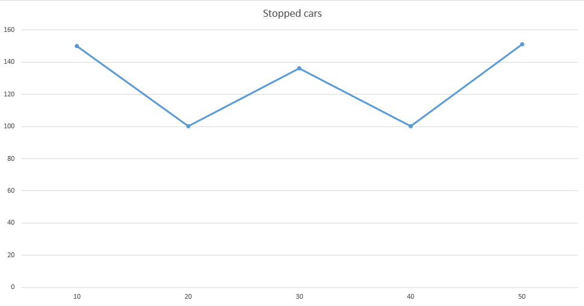

## Імітаційне моделювання комп'ютерних систем
## СПм-21-2, Могилевський Дмитро Ігорович
### Лабораторна робота №1. Опис імітаційних моделей
 

## Обрана модель в середовищі NetLogo:
[Traffic Grid](http://www.netlogoweb.org/launch#http://www.netlogoweb.org/assets/modelslib/Sample%20Models/Social%20Science/Traffic%20Grid.nlogo)
 

### Вербальний опис моделі:
Traffic Grid - Це модель руху транспорту в міській сітці. Це дозволяє керувати світлофорами та глобальними змінними, такими як обмеження швидкості та кількість автомобілів, а також досліджувати динаміку руху.
Можна розробити стратегії для покращення трафіку та зрозуміти різні способи вимірювання якості трафіку

Кожного кроку машини намагаються рухатися вперед із поточною швидкістю. Якщо їхня поточна швидкість менша за обмеження швидкості і прямо перед ними немає автомобіля, вони прискорюються. Якщо попереду є повільніша машина, вони зрівняються зі швидкістю повільнішої машини та сповільнюються. Якщо перед ними червоне світло або зупинилася машина, вони зупиняються.
Є два різні способи зміни освітлення. По-перше, користувач може змінити будь-яке світло в будь-який час, зробивши його поточним, а потім натиснувши CHANGE LIGHT. По-друге, світло може змінюватися автоматично один раз за цикл. Спочатку всі індикатори автоматично змінюватимуться на початку кожного циклу

### Керуючі параметри:
- **power?** - перемикає наявність світлофора
- **num-cars** - кількість автомобілів у симуляції 
- **tick-per-cycle** - встановлює кількість тактів, які минуть для кожного циклу. Це не впливає на ручне освітлення. Це дозволяє збільшувати або зменшувати деталізацію, з якою світло може автоматично змінюватися.
- **grid-sizw-x** - встановлює кількість наявних вертикальних доріг
- **grid-sizw-y** - встановлює кількість наявних горизонтальних доріг
- **current-pahase** - контролює зміни світла , якщо воно в автоматичному режимі. Значення повзунка представляє відсоток шляху через кожен цикл, на якому світло має змінюватися. Отже, якщо TICK-PER-CYCLE дорівнює 20, а CURRENT-PHASE — 75%,  то світло перемикатиметься на 15-му такті кожного циклу.
- **current-auto?** - перемикає поточне освітлення між автоматичним режимом, де воно змінюється один раз за цикл (відповідно до CURRENT-PHASE), і ручним, у якому ви безпосередньо керуєте ним за допомогою CHANGE LIGHT.
- **speed-limit** - максимльна швидкість автівок

 

## Обчислювальні експерименти

### 1. Вплив відсутності світлофорів на трафік 

Дослідимо залежність середньої кількості автівок ві зальної кількості кількість автівок беде зростати з кроком 50. 

Інші параметри будуть фіксованими: 
- **grid-sizw-x** - 9
- **grid-sizw-y** - 9
- **speed-limit** - 0,7

<table>
<thead>
<tr><th>Загальна кільсть машин</th><th>Кількість машин які стоять</th></tr>
</thead>
<tbody>
<tr><td>50</td><td>0,202</td></tr>
<tr><td>100</td><td>7,568</td></tr>
<tr><td>150</td><td>39,891</td></tr>
<tr><td>200</td><td>194,609</td></tr>
<tr><td>250</td><td>243,606</td></tr>
</tbody>
</table>

### 2. Залежність трафіку від швидкості машин 
Дослідимо залежність машин які стоять у заторі від їх швидкості при інших фіксованих параметрах. Швидкість буде змінюватися наступним чином: 0,1, 0,2, 0,3, 0,4 та 0,5. Всього 5 симуляцій, кожна по 5000 тіків. 

Параметри системи, при яких здійснювалась симуляція:
- **grid-sizw-x** - 9
- **grid-sizw-y** - 9
- **num-cars** - 200

<table>
<thead>
<tr><th>Швидкість</th><th>Кількість машин які стоять</th></tr>
</thead>
<tbody>
<tr><td>0.1</td><td>26.475</td></tr>
<tr><td>0.2</td><td>28.609</td></tr>
<tr><td>0.3</td><td>180.091</td></tr>
<tr><td>0.4</td><td>190.609</td></tr>
<tr><td>0.5</td><td>197.606</td></tr>
</tbody>
</table>

### 3. Залежність заторів від  тривалості світлофорів 

Експеримент буде проходити при **current-phase** = 10%, 20%, 30%, 40%, 50%, та фіксованих параметрах системи:
- **grid-sizw-x** - 9
- **grid-sizw-y** - 9
- **num-cars** - 200
- **speed-limit** - 0.5
- **ticks-per-cycle** - 70

Всього 5 симуляцій, кожна по 5000 тіків. 

<table>
<thead>
<tr><th>Процент від зальної кільколсті тіків</th><th>Кількість машин які стоять</th></tr>
</thead>
<tbody>
<tr><td>10%</td><td>149,943</td></tr>
<tr><td>20%</td><td>100,309</td></tr>
<tr><td>30%</td><td>136,099</td></tr>
<tr><td>40%</td><td>100,223</td></tr>
<tr><td>50%</td><td>151,327</td></tr>
</tbody>
</table>

 