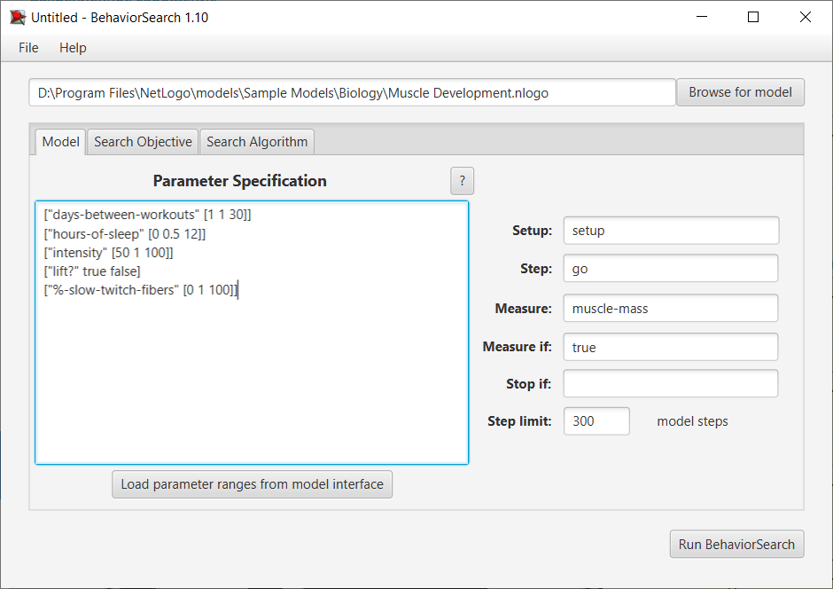
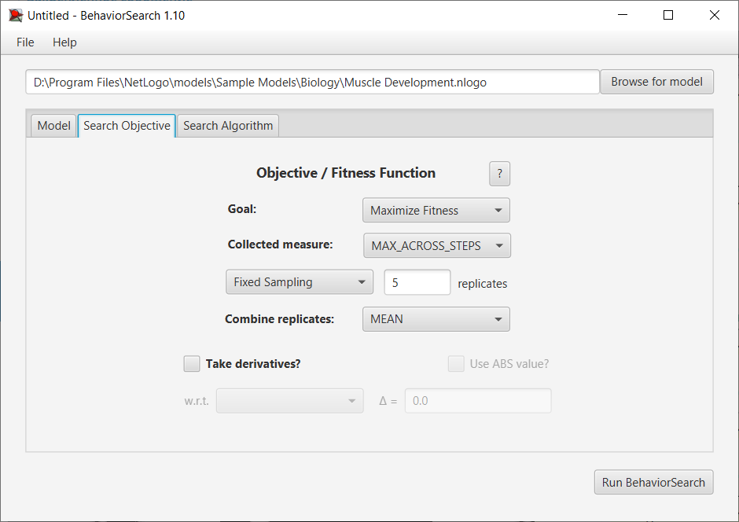
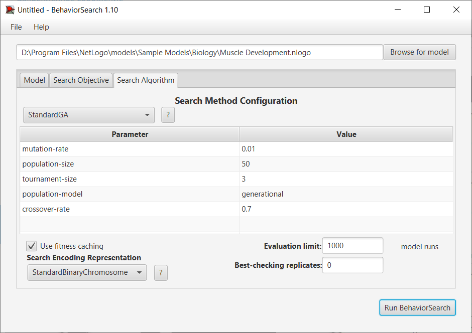
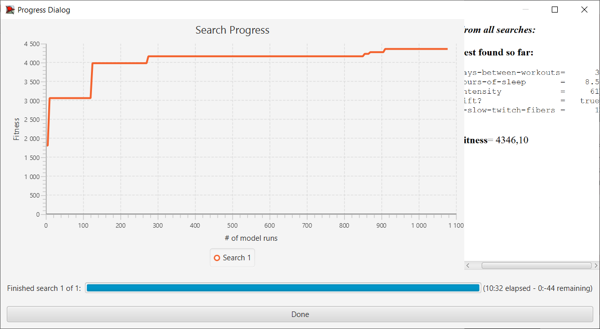
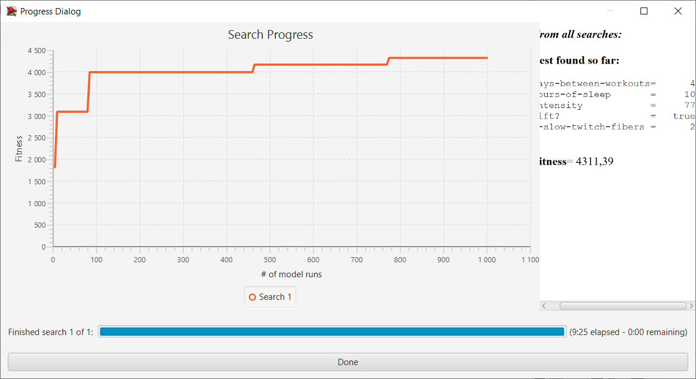

## Імітаційне моделювання комп'ютерних систем
## СПм-21-2, Могилевський Дмитро Ігорович
### Лабораторна робота №3. Використання засобів обчислювального інтелекту для оптимізації імітаційних моделей
 

## Обрана модель в середовищі NetLogo:
[Muscle Development](http://www.netlogoweb.org/launch#http://www.netlogoweb.org/assets/modelslib/Sample%20Models/Biology/Muscle%20Development.nlogo)
 

### Вербальний опис моделі:
Muscle Development - це фізіологічна модель вправ. Модель призначена для того, щоб допомогти зрозуміти фактори, що беруть участь у створенні відповідного гормонального балансу для розвитку м’язів під час фізичних вправ (підняття ваги).

Нарощування м'язів після силового тренування виникає в результаті гормональних реакцій, які відбуваються в організмі. 
Гормони, необхідні для розвитку м'язів, можна розділити на два великі класи: катаболічні гормони та анаболічні гормони. 
Катаболічні гормони руйнують м’язове волокно, щоб підготувати його до побудови м'язів за допомогою анаболічних гормонів. 
Примітка: катаболічні гормони відіграють життєво важливу роль, оскільки м’язові волокна мають бути розщеплені, перш ніж їх можна буде наростити.

Ця модель моделює ці ефекти за допомогою зображення поперечного перерізу м’яза на рівні м’язових волокон. Коли спостерігач активує м’язове волокно за допомогою силового тренування, волокно вивільняє хімічний сигнал, який призводить до сплеску гормонів у місці розташування волокна. Ці гормони впливають на розвиток волокон, як згадувалося вище, і з часом розщіпляються.

Кола позначають м'язові волокна. Тло, на якому вони з’являються, можна розглядати як клітинну рідину, яка містить анаболічні та катаболічні гормони. Чим яскравіший зелений, тим сильніше анаболічне (нарощування м’язів) середовище. Чим яскравіший жовтий, тим сильніше катаболічне (руйнування м’язів) середовище.

### Керуючі параметри:
- **intensity** - інтенсивність фізичних навантажень. Чим більша інтенсивність, тим більша кількість м’язових волокон буде втомлюватися під час кожного тренування.
- **hours-of-sleep** - кількість годин сну (клькість сну людини впливає на те, наскільки швидко організм розщеплює гормони).
- **days-between-workouts** - кількість днів між тренуваннями (частота тренувань впливає на те, скільки часу має тіло на відновлення).
- **%-slow-twitch-fibers** - наскільки ймовірно, що кожне волокно має характеристики повільного скорочення.
- **lift?** - параметр визначає чи активно людина піднімає тяжкості.

### Внутрішні параметри:
- **anabolic-hormone**. Гормон нарощування м'язів
- **catabolic-hormone**. Гормон розпаду м'язів
- **fiber-size**. Розмір волокон
- **max-size**. Максимальний розмір волокон
- **muscle-mass**. Розмір м'язових волокон
- **anabolic-hormone-max**
- **anabolic-hormone-min**
- **catabolic-hormone-max**
- **catabolic-hormone-min**
- **hormone-diffuse-rate**. Швидкість, з якою гормони дифундують з одного волокна в інші

### Критерії ефективності системи:
- М'язова маса
- Анаболічний гормон
- Катаболічний гормон

## Налаштування середовища BehaviorSearch:

**Вибрана модель**:
<pre>
D:\Program Files\NetLogo\models\Sample Models\Biology\Muscle Development.nlogo
</pre>

**Параметри моделі**:

<pre>
["days-between-workouts" [1 1 30]]
["hours-of-sleep" [0 0.5 12]]
["intensity" [50 1 100]]
["lift?" true false]
["%-slow-twitch-fibers" [0 1 100]]
</pre>

Використана міра:
 
Для фітнес-функції було обрано максимальне значення маси м'язів, вираз для її розрахунку взято з налаштувань графіка аналізованої імітаційної моделі в середовищі NetLogo та вказано у параметрі "**Measure**":

<pre>
muscle-mass
</pre>

Максимальне значення маси м'язів повинно враховуватися в середньому за весь період симуляції тривалістю 300 тактів, починаючи з 0 такту симуляції.

У даному випадку параметр зупинки за умовою ("**Stop if**") не використовувався.
Загальний вигляд вкладки параметрів:

**Налаштування цільової функції** (Search Objective):
Метою підбору параметрів імітаційної моделі, що описує розвиток м'язів при різних параметрах, є максимізація значення маси м'язів - це вказано через параметр "Goal" зі значенням Maximize Fitness. 

 При цьому цікавить не просто максимальна маса м'язів у якийсь окремий момент симуляції, а максимальне  значення за всю симуляцію.
 Для цього у параметрі "**Collected measure**", що визначає облік значень вибраного показника, зазначено **MAX_ACROSS_STEPS**.

Загальний вигляд вкладки налаштувань цільової функції:

**Налаштування алгоритму пошуку** (Search Algorithm):

Загальний вид вкладки параметрів алгоритму пошуку:

 

### Результати використання BehaviorSearch:

Результат пошуку параметрів імітаційної моделі, використовуючи **генетичний алгоритм**:

Результат пошуку параметрів імітаційної моделі, використовуючи **випадковий пошук**:

Результати відрізняються не суттєво. Час затрачений на пошук параметрів генетичним алгоритмом був у 2 рази більше ніж випадковим пошуком. Але результати майже не выдрізняються. 
В даному випадку, краще скоротити час на пошук та використати Random Search. 